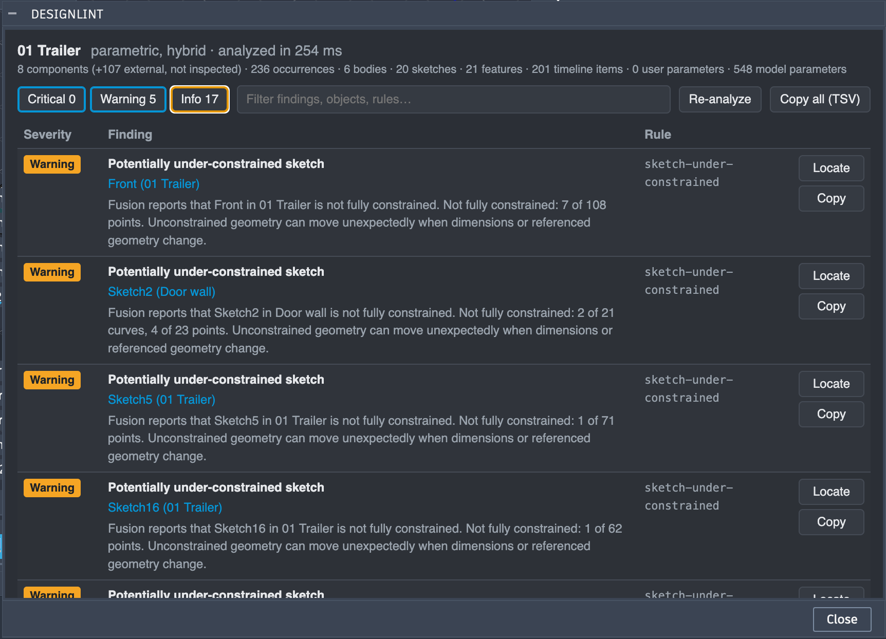

# DesignLint

**CAD quality & parametric design analysis for Autodesk Fusion**

> ESLint catches problems in code before they become bugs.
> DesignLint catches problems in CAD before they become design failures.

DesignLint is an Autodesk Fusion add-in that inspects the active design and lists the things that make a model
fragile, hard to change or hard to understand, all in one place, with a way to jump to each one.

Fusion already marks problems on individual timeline items and browser nodes, but those markers are spread
across the UI. And many of the things that make a model fragile aren't errors at all, so Fusion doesn't flag them
anywhere. DesignLint collects both into a single, filterable list.

> **Status: early alpha (0.1.0).** Analysis is deterministic and runs entirely inside Fusion. There is no cloud service, no AI,
> and nothing leaves your machine. Expect rough edges; feedback is very welcome.

## What it checks

| Rule | Severity | What it reports | Based on |
|---|---|---|---|
| `timeline-health` | Critical / Warning | Features, joints and other timeline items Fusion itself marks as failed or with a warning, with Fusion's message | `TimelineObject.healthState` |
| `sketch-health` | Critical / Warning | Sketches Fusion marks with an error or warning (e.g. lost references) | `Sketch.healthState` |
| `sketch-under-constrained` | Warning | Sketches Fusion reports as not fully constrained, with how many curves/points/texts are free | `Sketch.isFullyConstrained`, `SketchEntity.isFullyConstrained` |
| `repeated-values` | Info | The same hard-coded value (e.g. `30 mm`) typed into 3 or more features, sketches or joints, a candidate for a user parameter | `ModelParameter` values that reference no other parameter |
| `default-names` | Info | Components, bodies, sketches, features, construction geometry and joints still named `Sketch12`, `Extrude7`, `Rigid 33`… | object names |

Every finding comes from what Fusion reports about the actual design; nothing is guessed or simulated. Severity follows
a simple principle:

- **Critical**: Fusion itself reports the object as failed.
- **Warning**: something that may cause problems when the design changes.
- **Info**: a maintainability suggestion, never an engineering error.

DesignLint does not tell you your design is wrong. Wording like *"Potentially under-constrained sketch"* and
*"may represent design intent"* is deliberate.

## Example

Real output on a trailer assembly (236 occurrences, 20 sketches, 548 model parameters), analyzed in 254 ms:



Other rules show up the same way. *Illustrative examples, not from the design above:*

```text
Critical  Timeline item has an error in Fusion
          Fillet3 (FilletFeature in Bracket)
          Fusion reports an error on Fillet3. Fusion's message: "Unable to create fillet"
Info      Repeated hard-coded value: 3.00 mm
          Base plate (Bracket), Rib (Bracket), Lid (Cover)
          3.00 mm is entered directly 4 time(s) across 3 model elements. This may represent
          design intent that could be expressed through a user parameter.
```

In the results palette you can:

- filter by severity or text;
- click any object name (or **Locate**) to select it in Fusion;
- copy a finding, or all visible findings as tab-separated text for Excel or an issue tracker;
- **Re-analyze** after making changes, keeping your filters.

## Installation (development / alpha)

Requirements:
- Autodesk Fusion with TypeScript add-in support (September 2026 or later).
- Developed and tested on macOS (Fusion build 2705.1.25). Windows should work the same way but hasn't been tested yet.

1. Get the add-in folder. Either:
   - clone this repository (the add-in is the `DesignLint/` folder inside it), or
   - download a release zip and extract the `DesignLint` folder.
2. In Fusion, open **Utilities → Add-Ins → Scripts and Add-Ins**.
3. Click **+** → **Script or add-in from device** and select the `DesignLint` folder.
4. Select **DesignLint** in the list and switch **Run** on. Tick **Run on Startup** if you want it every session.
5. Open a design and click **Analyze Design** in the **Utilities** tab → **Add-Ins** panel.

Alternatively, copy the `DesignLint` folder into Fusion's add-ins folder:
- macOS: `~/Library/Application Support/Autodesk/Autodesk Fusion 360/API/AddIns`
- Windows: `%APPDATA%\Autodesk\Autodesk Fusion 360\API\AddIns`

## Known limitations

- **External references are not inspected.** Components linked from other documents (🔗) are counted but not analyzed;
  open and analyze those documents on their own. This includes errors inside them, which Fusion shows as a ⚠ on the root node.
- **Default names are detected for Fusion's English UI only.** A localized Fusion generates other names.
- **Fusion rejects selecting some joints** (`invalid argument entity`), so Locate reports them by name instead.
- **Analysis runs on Fusion's main thread**, as all add-ins do, so Fusion pauses while it runs. On the designs tested
  so far (up to 236 occurrences and 548 parameters) that took about 250 ms; very large designs will take longer.
- **No health score.** A single number would look more authoritative than it is. It may come later with a documented method.

## Development

The add-in is plain TypeScript. Fusion compiles it when it loads the add-in, so there is no build step for the add-in itself.

```sh
npm install        # dev tools only: typescript + @types/node
npm test           # unit tests for rules and analysis (Node's built-in test runner)
npm run typecheck  # type-checks DesignLint/ against the Fusion typings from your local install
npm run check      # both
```

To debug in Fusion, link the `DesignLint/` folder as described above, then **Stop** and **Run** it after each change.
Diagnostics (timings, anything that couldn't be inspected, Locate failures) go to Fusion's **TEXT COMMANDS** window.

- `docs/TESTING.md`: unit tests vs the manual in-Fusion checklist.
- `internal notes`: verified Fusion API behavior, including TypeScript-runtime pitfalls (`instanceof`,
  `localeCompare`, palettes, entity tokens, selection) that type-check fine but fail inside Fusion.

### Project structure

```text
DesignLint/                   the add-in (the folder Fusion loads)
├── DesignLint.manifest       add-in metadata (name, version, supported OS)
├── DesignLint.ts             entry point: run() / stop()
├── resources/findings.html   results palette (HTML/CSS/JS)
└── src/
    ├── analyzer/             modelExtractor (the only Fusion API reader), analysisEngine, modelSummary
    ├── models/               plain data types: DesignModel, Finding, AnalysisResult, ModelSummary
    ├── rules/                one file per rule family + ruleRegistry
    ├── ui/                   command, palette, Locate, text fallback report
    ├── utils/                logging, timing, ICU-free sorting
    └── constants.ts          IDs, rule settings, default-name patterns, Fusion enum values
tests/                        unit tests + fixtures
scripts/typecheck.mjs         finds Fusion's bundled typings and type-checks the add-in
docs/                         API notes, testing guide, original project brief
```

### Architecture

```text
Fusion API
    ↓
Model extraction        analyzer/modelExtractor.ts: reads the active design once; per-element failures are recorded, not fatal
    ↓
Normalized model        models/DesignModel.ts: plain data, no Fusion objects
    ↓
Rule engine             analyzer/analysisEngine.ts + rules/: pure, deterministic, unit-tested
    ↓
Findings                models/Finding.ts: severity, category, affected objects (with entity tokens for Locate)
    ↓
UI                      ui/: findings palette, Locate, Re-analyze
```

Only the extractor and the UI talk to Fusion. Everything between them is plain TypeScript, which is what makes the
rules testable without Fusion. The same normalized model is meant to be what any future AI layer consumes, rather
than raw Fusion objects.

## Roadmap

*Future work. None of this is implemented.*

- **v0.2: Better dependency analysis.** Fragile references (e.g. a sketch that depends on geometry from a fillet), once
  the Fusion API data is verified. Optional inspection of externally referenced documents.
- **v0.3: Design change impact analysis.**
- **v0.4: AI explanations** ("Why is this reference fragile?"), consuming the normalized model and findings.
- **v0.5: "Ask about this design."**
- **v0.6: "What if?" simulation**: change a parameter in a temporary variant and inspect the consequences.
- **v0.7: Suggested fixes**, e.g. "replace this hard-coded dimension with WallThickness".
- **v1.0: DesignLint Pro**: advanced rules, reports, custom rules.

Later, possibly: team-wide engineering standards ("DesignLint Rules"), and MCP integration with Fusion's agentic
tooling. That would only come after checking the current official Autodesk documentation for what it supports.

## License

[MIT](LICENSE) © 2026 Jakov Kristović

## Feedback

This is an early alpha. Issues, false positives and "I wish it checked…" ideas are very welcome.

DesignLint is an independent project and is not affiliated with or endorsed by Autodesk. Autodesk and Fusion are
trademarks of Autodesk, Inc.
